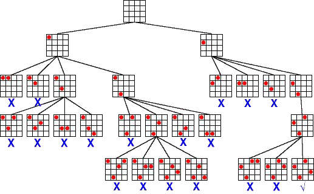

# Backtracking 

El Backtracking es una técnica de búsqueda y exploración utilizada en problemas donde se requiere encontrar todas las soluciones posibles (o una solución óptima) dentro de un conjunto de posibilidades.

<p align="center">
  
</p>

Se basa en un enfoque de "prueba y error", donde se exploran diferentes opciones y, si una elección no es válida, se retrocede (backtrack) para intentar otra.

---

# Características del Backtracking

Se usa en problemas de búsqueda y optimización.

- Explora soluciones paso a paso.
- Retrocede cuando una solución parcial no lleva a una respuesta válida.
- Se representa mediante árboles de decisión.
- Puede mejorarse con técnicas de poda para evitar cálculos innecesarios.4
    - Las técnicas de poda son optimizaciones que se aplican en algoritmos de búsqueda (como
backtracking) para evitar explorar ramas innecesarias del árbol de decisiones, reduciendo así el
tiempo de ejecución.

---

# ¿Por qué es importante la poda?

- Reduce el número de combinaciones a explorar.
- Disminuye el tiempo de ejecución.
- Hace que los algoritmos sean más eficientes sin afectar la corrección.

---

# Tipos de Poda en Backtracking

## Poda por Factibilidad 

Se usa para descartar caminos que violan restricciones antes de seguir explorando.

- Ejemplo: En el problema de las N reinas, si colocamos una reina en una columna donde otra ya ataca, no seguimos
explorando.

---

## Poda por Optimalidad 

Se usa cuando sabemos que una solución parcial no puede mejorar una solución encontrada previamente.

- Ejemplo: Se eliminan rutas malas antes de calcularlas completamente, ahorrando tiempo.

---

## Poda por Detección Temprana

Se usa para detener una rama antes de generar más combinaciones, al identificar que no es viable.

- Ejemplo: En un sudoku, si encontramos que un número ya no puede ser colocado en ninguna celda de una fila,
dejamos de intentar.

---

# Ejercicio Backtracking

Dado un tablero de ajedrez de tamaño n×n, colocar n reinas en el tablero de forma que ninguna de ellas se amenace entre sí. Una
reina amenaza a otra si se encuentra en la misma fila, columna o en cualquiera de las dos diagonales.
Objetivo: Encontrar todas las configuraciones posibles del tablero donde las n reinas estén colocadas de manera segura, o determinar
si no existe una solución para el tamaño de tablero dado.

Restricciones:

1. Una sola reina por fila.
2. Una sola reina por columna.
3. Las diagonales no deben contener más de una reina.

**Entrada:** Un número entero n >= 1 que representa el tamaño del tablero.
**Salida:** Una lista de configuraciones posibles del tablero, donde cada configuración muestra la posición de las reinas en el tablero o un
mensaje indicando que no hay solución.


## Código 

```
public class NReinas {

    static int N = 4; // Cambia N para diferentes tamaños de tablero

    public static void main(String[] args) {
        int[][] tablero = new int[N][N];

        if (resolverNReinas(tablero, 0)) {
            imprimirTablero(tablero);
        } else {
            System.out.println("No hay solución.");
        }
    }

    // Función principal para resolver el problema
    static boolean resolverNReinas(int[][] tablero, int fila) {

        // Caso base: si colocamos todas las reinas, hay solución
        if (fila == N) {
            return true;
        }

        // Intentar colocar una reina en cada columna de la fila actual
        for (int columna = 0; columna < N; columna++) {

            if (esSeguro(tablero, fila, columna)) {

                tablero[fila][columna] = 1; // Colocar reina

                // Llamada recursiva para la siguiente fila
                if (resolverNReinas(tablero, fila + 1)) {
                    return true;
                }

                // Backtracking: quitar la reina si no funciona
                tablero[fila][columna] = 0;
            }
        }

        // Si no se pudo colocar en ninguna columna
        return false;
    }

    // Verifica si una reina puede colocarse en tablero[fila][columna]
    static boolean esSeguro(int[][] tablero, int fila, int columna) {

        // Revisar la misma columna
        for (int i = 0; i < fila; i++) {
            if (tablero[i][columna] == 1) {
                return false;
            }
        }

        // Revisar diagonal izquierda
        for (int i = fila, j = columna; i >= 0 && j >= 0; i--, j--) {
            if (tablero[i][j] == 1) {
                return false;
            }
        }

        // Revisar diagonal derecha
        for (int i = fila, j = columna; i >= 0 && j < N; i--, j++) {
            if (tablero[i][j] == 1) {
                return false;
            }
        }

        return true;
    }

    // Función para imprimir el tablero
    static void imprimirTablero(int[][] tablero) {
        for (int i = 0; i < N; i++) {
            for (int j = 0; j < N; j++) {
                System.out.print(tablero[i][j] + " ");
            }
            System.out.println();
        }
    }
}

```