# ¿Qué es BackTracking?

Muchos problemas pueden resolverse buscando una solución fácil y directa pero, en otras oportunidades ésta solución no resulta tan sencilla o simplemente es ineficiente. 

Una técnica conocida de diseño de algoritmos denominada backtracking permite buscar todas las soluciones posibles de un problema incluyendo la óptima; pero no siempre resulta eficiente en tiempo y espacio.

  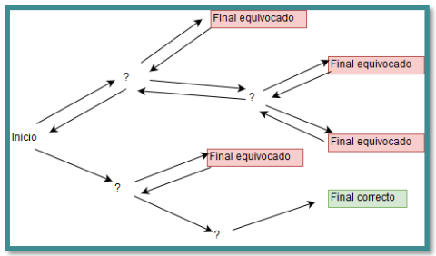

---

# Definición

El método de backtracking(también llamado búsqueda atrás o retroceso) proporciona una manera sistemática de generar todas las posibles soluciones a un problema dentro de un espacio de búsqueda.

Gradualmente construye tareas básicas y las inspecciona para determinar si conducen a la solución del problema. Si una tarea no conduce a la solución, retrocede a la tarea original y se prueba otra cosa distinta.

Lo más importante en backtracking es hacer un retroceso mínimo, o sea, no destruir todo si no pudo encontrar una solución, sino sólo borrar lo necesario para poder seguir explorando sin perder todo el camino que se ha recorrido.

---

## Árbol de soluciones

Conceptualmente la ejecución de un algoritmo de backtracking se puede representar como un árbol, donde cada nodo del árbol representa un paso (tarea), cuando se llega a un nodo que no tiene solución entonces “se devuelve” y crea un nuevo nodo. La solución del problema se ubica en las hojas del árbol.

  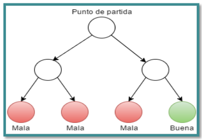

---

# Características

Un método escrito usando la técnica backtracking se caracteriza por:

- Cada decisión nos lleva a un nuevo conjunto de decisiones.
- Espacio de búsqueda grande.
- Funciona a ensayo y error.
- Si existen una o varias soluciones el backtracking las encuentra.
- Consume mucha memoria para tener que almacenar el camino que se va formando a medida que se avanza hacia la solución.
- Busca solución a problemas complejos.
- Normalmente, el backtracking se suele implementar como un procedimiento recursivo.

---

# Requerimientos

Un método escrito usando la técnica backtracking requiere:

- Un espacio de búsqueda, es decir, un conjunto de posibilidades o "estados" del problema a resolver.
- Un estado inicial, el punto de partida del problema.
- Un conjunto de estados finales. Estos se definen mediante alguna característica, criterio o condición. 
- Una memoria de estados. Debemos guardar el camino que llevamos. Generalmente una pila (recursión).

Cuando usamos recursividad en un algoritmo Backtracking, implícitamente se está guardando en una pila en memoria los estados del problema ya que los llamados recursivos (cuando un método se llama así mismo) se guardan en una pila.

---

# Ejemplos

Buscar una ruta a través del laberinto para llegar a la solución. Además el backtracking se usa para generar laberintos aleatoriamente.

  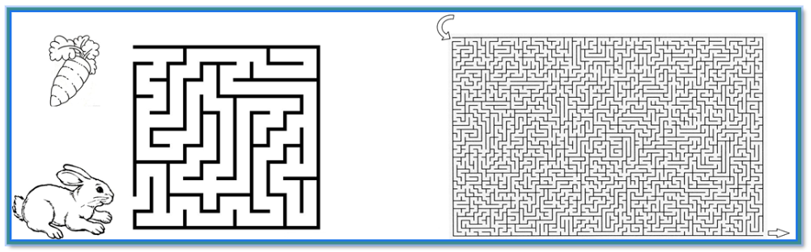

Backtracking también se usa para:

- Resolver Sudokus, Sopa de letras, crucigramas. 
- Problema de las ocho reinas (modelo de máxima cobertura)
- Calcular expresiones regulares
- Gran utilidad en la teoría de grafos: Problema del cartero (recorrer el grafo) y Colorear un grafo.

  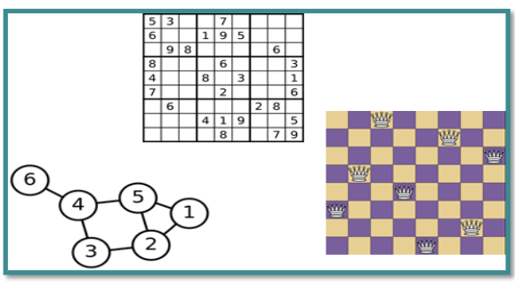

---

# ANÁLISIS ALGORITMO DEL LABERINTO
## Problema del laberinto

  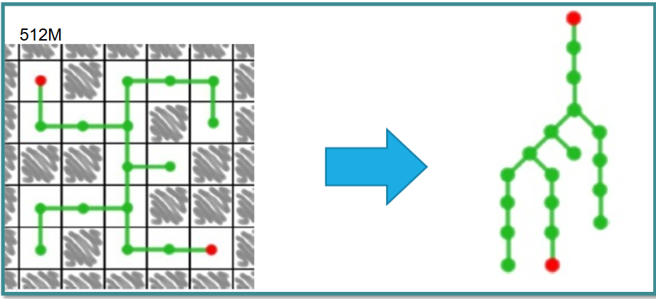

  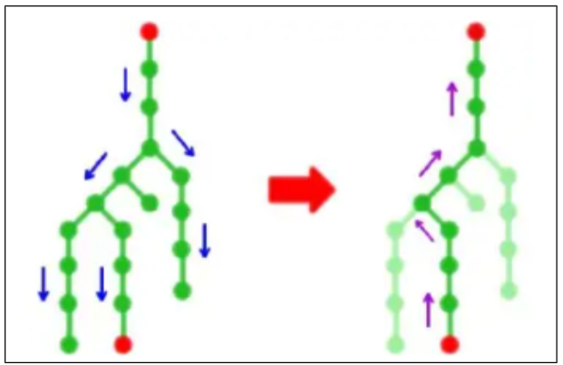

## Análisis algoritmo Laberinto

  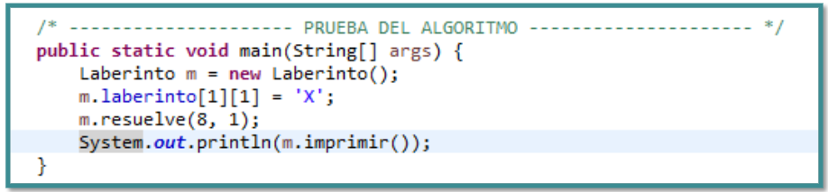

- Paso(x, y) es un algoritmo recursivo que tiene como retorno un boolean.
- En la sentencia laberinto[x][y] = ‘S’, se asigna el punto de partida.

  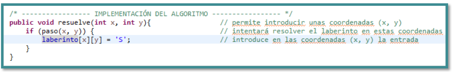

---

## Modelo del tablero

  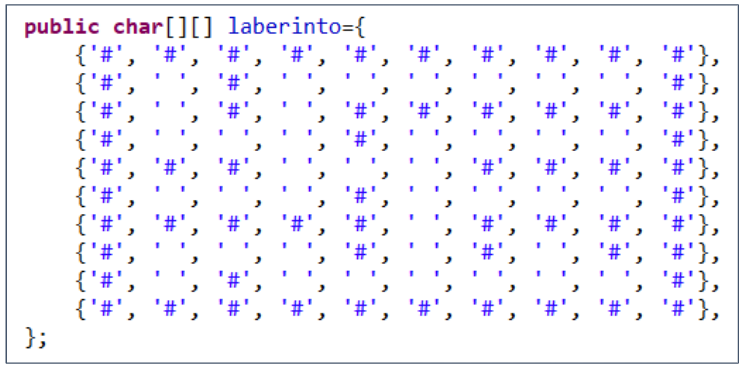

  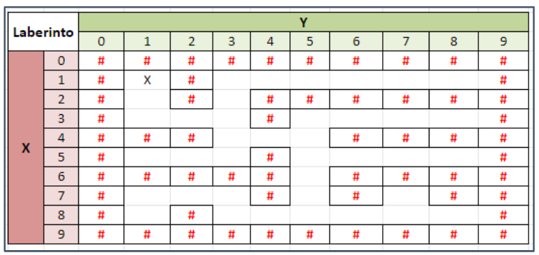

**Nota:** Luego de cada llamado recursivo existe la necesidad de retornar verdadero
o falso, ya que es posible que se generen ciclos infinitos.

  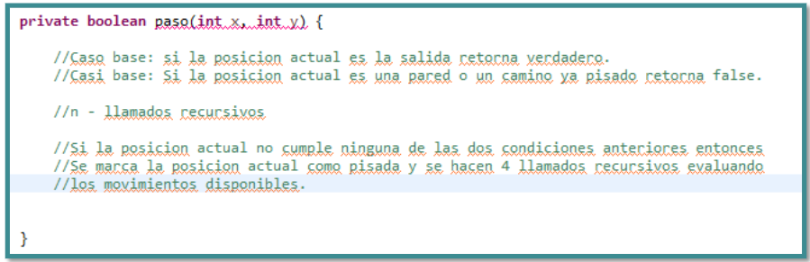

---

# Problema de las N-Reinas 

El problema de las 8 reinas consiste básicamente en ubicar 8 reinas en un tablero de ajedrez de tal forma que ninguna se ataque entre sí, es decir, que las reinas no estén ubicadas en la misma fila, columna o diagonal. Este problema se soluciona usando backtracking, y no solo para encontrar solución al problema de las 8 reinas, sino para solucionar el problema de las N reinas (ubicar n reinas en un tablero n x n), o sea, para cualquier tamaño

  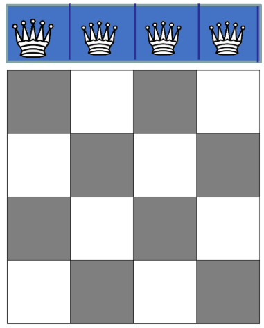

---

## ANÁLISIS ALGORITMO DEL LABERINTO (Problema de las N-Reinas)

  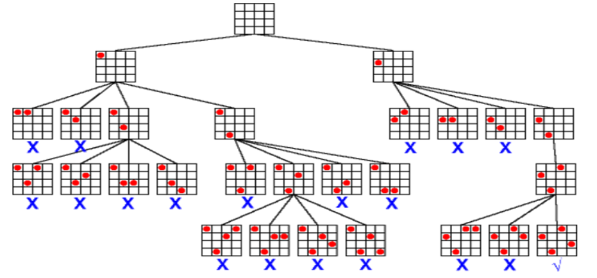

--- 

# Otros algoritmos

- Archivos
- Salto del caballo
- Algoritmo sudoku
- Algoritmo de la mochila

