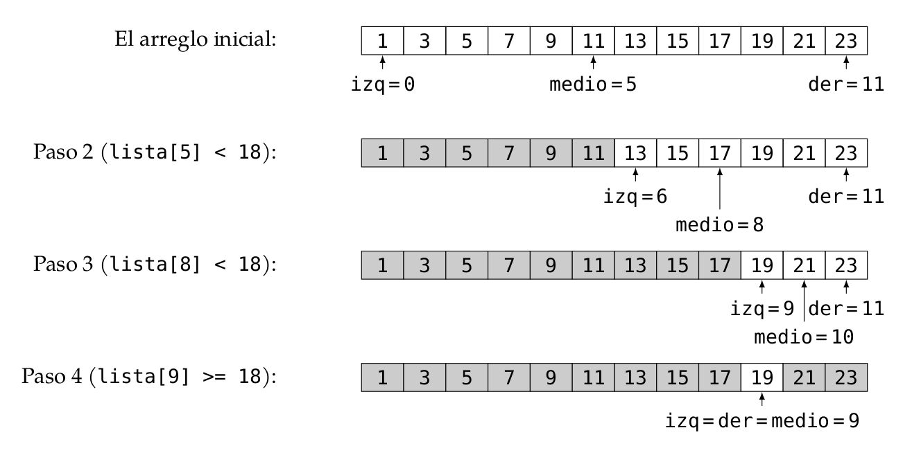

# Búsqueda Binaria 

La **búsqueda binaria** es un algoritmo eficiente que se usa para encontrar un elemento en
una **lista ordenada.**

Su enfoque se basa en Divide y Vencerás, dividiendo el problema en subproblemas más pequeños hasta encontrar el elemento deseado.

<p align="center">
  
</p>

---

# ¿Cómo funciona la Búsqueda Binaria?

1. Se toma un arreglo ordenado y se define un límite inferior (izquierda) y un límite
superior (derecha).

2. Se calcula el punto medio (medio = derecha + (izquierda - derecha)).

3. Se compara el valor en la posición medio con el valor buscado:

- Si el elemento en medio es el buscado, se ha encontrado la respuesta.
- Si el valor buscado es menor, se repite la búsqueda en la mitad izquierda (derecha = medio - 1).
- Si el valor buscado es mayor, se repite la búsqueda en la mitad derecha (izquierda = medio + 1).

4. El proceso se repite hasta que izquierda > derecha, lo que indica que el elemento no
está en el arreglo.

---


## Problema: Búsqueda Binaria

Dado un arreglo A de longitud n con números enteros ordenados de forma ascendente y un valor
objetivo X, implementa un algoritmo eficiente que determine si el valor X está presente en el arreglo.
Si se encuentra el valor, devuelve su posición; de lo contrario, devuelve un indicador de que el valor
no está presente.

### Código 

```
public static int busquedaBinaria(int[] arreglo, int inicio, int fin, int objetivo) {
    
    // Caso base: no hay más elementos que buscar
    if (inicio > fin) {
        return -1;
    }

    // Calcular la posición media
    int medio = inicio + (fin - inicio) / 2;

    // Si el objetivo está en la posición media, devolvemos la posición
    if (arreglo[medio] == objetivo) {
        return medio;
    }

    // Si el objetivo es menor, buscar en la mitad izquierda
    if (objetivo < arreglo[medio]) {
        return busquedaBinaria(arreglo, inicio, medio - 1, objetivo);
    }

    // Si el objetivo es mayor, buscar en la mitad derecha
    return busquedaBinaria(arreglo, medio + 1, fin, objetivo);
}

```

