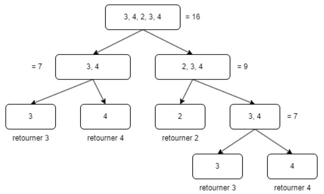

# Divide y Vencerás 

El paradigma de Divide y Vencerás **(Divide and Conquer)** se basa en dividir un problema en subproblemas más pequeños, resolverlos de manera independiente y luego combinar sus soluciones para obtener el resultado final.

Es una técnica muy eficiente en términos de complejidad computacional, especialmente cuando se puede dividir el problema en partes balanceadas y la combinación no es costosa.

  

--- 

## Características Principales

### División

Se descompone el problema en varias partes más pequeñas del mismo tipo.

### Resolución

Se resuelven los subproblemas, generalmente de manera recursiva.

### Combinación

Se juntan los resultados parciales para formar la solución final.