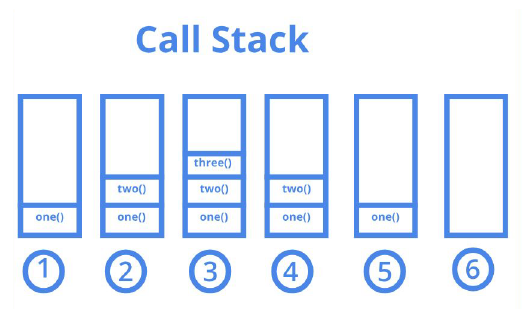
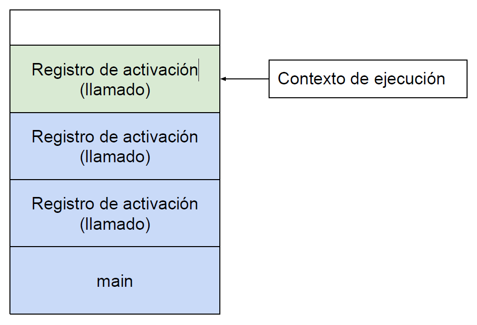
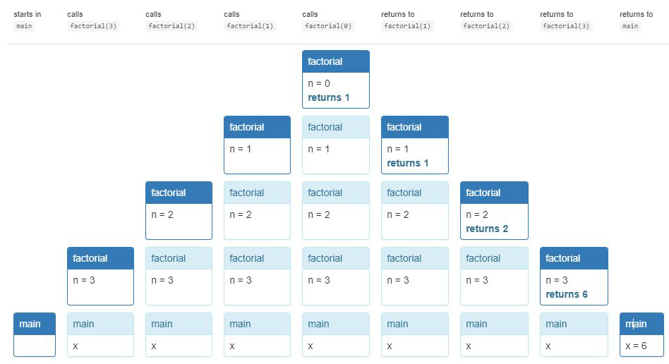

# La Pila del Ordenador y la Recursividad

La memoria de un ordenador a la hora de ejecutar un programa queda dividida
en dos partes:

- La zona donde se almacena el código del programa.
- La zona donde se guardan los datos: pila (utilizada para llamadas recursivas).

---

<p align="center">
  
</p>

---

La pila o Call Stack, es una estructura de datos utilizada por el sistema para
gestionar las llamadas a funciones en un programa. Funciona bajo el principio
LIFO (Last In, First Out).

Cada que se llama una función se crea un marco de pila (Stack Frame) que
almacena:

- Los parámetros de la función.
- Las variables locales.
- La dirección de retorno (donde continuar la ejecución después de que la
función termine)

---

# Pila

Pila:

- Contextos de ejecución
- La función activa todas la funciones pendientes
- Contexto de ejecución:
- Dirección de retorno
- Parametros
- Variables locales

<p align="center">
  
</p>

---

# Ejemplos de Recursividad 

- Escriba una función recursiva que calcule la suma de los primeros n números
naturales ingresados por el usuario. Por ejemplo, si el usuario ingresa 5, el
programa debe devolver 15 (1 + 2 + 3 + 4 + 5).

```
public static int sumaEnteros(int n){
        if(n == 0){
            return 0;
        }else{
            return n + sumaEnteros(n - 1);
        }
    }
```

---

# Factorial 

Escribe un programa que calcule el factorial (!) de un entero no negativo.
1! = 1

2! = 2 ➔ 2 * 1

3! = 6 ➔ 3 * 2 * 1

4! = 24 ➔ 4 * 3 * 2 * 1

5! = 120 ➔ 5 * 4 * 3 * 2 * 1

---

> Iterativamente 

```
public static int factorialIterativo(int n) {
    int resultado = 1;
    for (int i = 1; i <= n; i++) {
        resultado *= i; // Multiplicamos cada número
    }
    return resultado;
}
```

> Recursivamente 

```
public static int factorialRecursivo(int n) {
    if (n == 0) return 1; // Caso base
    return n * factorialRecursivo(n - 1); // Llamada recursiva
}
```

--- 

> Pila

<p align="center">
  
</p>

---
