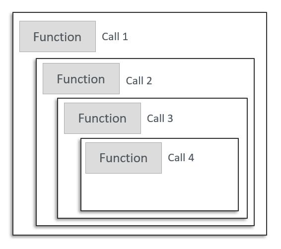
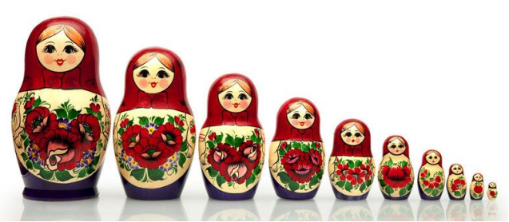
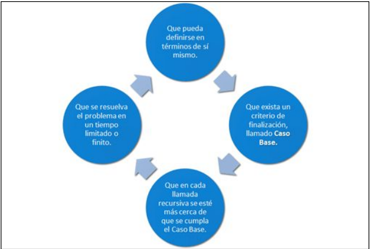

## ¿Qué es la Recursividad?


La recursividad es un concepto fundamental en matemáticas y en computación.

Es una alternativa diferente para implementar estructuras de repetición (Ciclos). Los módulos se hacen llamadas recursivas.

También llamada como recursión o recurrencia, es una técnica de programación elemental que permite que una función pueda definirse y llamarse en términos de si misma, pudiendo llegar a ser una solución diferente al proceso iterativo.

---

<p align="center">
  
</p>

---

# ¿Qué es Recursividad desde el punto de vista de la computación?


- La recursividad (recursión) es aquella propiedad que posee un método por la
cual puede llamarse a sí mismo. Aunque se puede utilizar la recursividad
como una alternativa a la iteración.

- Es menos eficiente en términos de tiempo de computadora que una solución
iterativa, debido a las operaciones auxiliares que llevan consigo las
invocaciones suplementarias a los métodos.

- Diversas técnicas algorítmicas utilizan la recursión, como los algoritmos
divide y vence y los algoritmos de vuelta atrás.

--- 

# Ventajas y Desventajas de la recursividad

| Ventajas | Desventajas | 
| :---:    | :---:       |
|Simplifica problemas complejos al dividirlos en subproblemas más pequeños y similares | Puede ser difícil de entender si no se comprende bien el caso base y la recursión |
| Reduce la cantidad de líneas de código en comparación con las soluciones iterativas | Consumo alto de recursos como tiempo y memoria |
| No cuenta con una secuencia de pasos exacta para la solución del problema | Puede ser difícil de depurar debido a la complejidad de las llamadas anidadas 1

---

# Tipos de Recursividad 

| Tipo | Descripción |
| :---:| :---: |
| Recursividad Directa | Una función se llama a sí misma directamente |
| Recursividad Indirecta | Una función llama a otra función, y esta segunda función termina llamando a la primera |
| Recursividad Lineal | Cada llamada recursiva tiene solo una llamada adicional | 
| Recursividad Múltiple | Cada llamada recursiva genera múltiples llamadas adicionales |
| Recursividad de Cola | La llamada recursiva es la última operación realizada por la función, lo que permite optimización |
| Recursividad No de Cola | La llamada recursiva no es la última operación; los resultados  intermedios se procesan después |

---

# Recursividad Directa

```
public static int sumaDirecta(int n) {
  if (n == 0) return 0; // Caso base
  return n + sumaDirecta(n - 1); // Llamada directa
}
```
---

# Recursividad Indirecta

```
public static int sumaIndirectaA(int n) {
      if (n == 0) return 0; // Caso base
      return n + sumaIndirectaB(n - 1); // Llama a la función B
}

public static int sumaIndirectaB(int n) {
      if (n == 0) return 0; // Caso base
      return sumaIndirectaA(n); // Llama a la función A
}
```

---

# Recursividad Lineal

```
public static int sumaLineal(int n) {
      if (n == 0) return 0; // Caso base
      return n + sumaLineal(n - 1); // Solo una llamada recursiva
}
```

---

# Recursividad Múltiple

```
public static int sumaMultiple(int n) {
      if (n == 0) return 0; // Caso base
      return n + sumaMultiple(n - 1) + sumaMultiple(n - 1); // Dos llamadas recursivas
}
```

---

# Recursividad de Cola

```
public static int sumaDeCola(int n, int acc) {
      if (n == 0) return acc; // Caso base
      return sumaDeCola(n - 1, acc + n); // Última operación es la llamada recursiva
}
```
---

# Recursividad No de Cola 

```
public static int sumaDirecta(int n) {
      if (n == 0) return 0; // Caso base
      return n + sumaDirecta(n - 1) // Llamada recursiva no es la última operación. Se realiza la suma después
}
```

---

# Ejemplo de la Matrushka 

La Matrushka es una artesanía tradicional rusa. Es una muñeca de madera que
contiene otra muñeca más pequeña dentro de sí. Ésta muñeca, también contiene
otra muñeca dentro. Y así, una dentro de otra.

---

<p align="center">
  
</p>

---

```
public static void imprimirMatrushka(int n){

        if(n == 0){
           System.out.println("No hay Matrushkas para abrir"); 
        }else{
            System.out.println("Abriendo Matrushka " + n);
            imprimirMatrushka(n-1);
        }

    }
```

--- 

# Funcionamiento de la recursividad 

## Caso Base

- Una solución simple para un caso particular (puede haber más de un caso
base).
- En un algoritmo recursivo, se entiende por caso base el que se resuelve sin
recursión, directamente con unas pocas sentencias elementales.
- El caso base se ejecuta cuando se alcanza la condición de parada de llamadas
recursivas.
- Para que funcione la recursión el progreso de las llamas debe tender a la
condición de parada.

---

## Caso Recursivo 

Una solución que involucra volver a utilizar la función original, con
parámetros que se acercan más al caso base.

- Los pasos que sigue el caso recursivo son los siguientes:
- El procedimiento se llama a sí mismo.
- EL problema se resuelve, tratando el mismo problema pero de tamaño
menor.
- La manera en la cual el tamaño del problema disminuye asegura que el caso
base eventualmente se alcanzará.

Se considera recursivo  si: 

<p align="center">
  
</p>

---

# Recursividad vs Iteración 

| Aspecto | Recursividad | Iteración | 
| :---: | :---: | :---: |
| Estructura | Involucra una llamada recursiva y un caso base que detiene la recursión | Utiliza variables de control y condiciones de terminación |
| Consumo de Memoria | Puede usar mucha memoria debido al uso de la pila de llamadas | Consume menos memoria, ya que no requiere una pila adicional |
| Eficiencia | Puede ser menos eficiente si no se optimiza (por ejemplo, recursión de cola) | Generalmente más eficiente para problemas simples, ya que no hay llamadas adicionales | 

--- 

| En ambos casos podemos tener ciclos infinitos | 
| :---: |
| LA RECURSIVIDAD SE DEBE USAR CUANDO SEA REALMENTE NECESARIA, ES DECIR, CUANDO NO EXISTA UNA SOLUCIÓN ITERATIVA SIMPLE |

---

# Paso de parámetros a los módulos recursivos

## Tipos de parámetros: por valor

Se hace una copia de los parámetros al pasar a la función recursiva.

- Las modificaciones realizadas dentro de la función no afectan el valor original
fuera de la función.

- Al salir de la función, los parámetros vuelven a tener su valor original.
En Java, los tipos primitivos (int, double, char, etc.) se pasan por valor, por lo que cualquier modificación dentro de la función no afecta la variable original.

---

## Tipos de parámetros: por referencia

Se pasa la referencia de la variable, lo que permite modificar directamente el
valor original.

- Las modificaciones hechas dentro de la función afectan el valor de la variable
fuera de ella.

En Java, los objetos (como listas, arrays, o instancias de clases) se pasan por
referencia. Esto permite modificar directamente el contenido de los objetos.