## Listas Enlazadas 

Contenido:

 1. Fundamentos teóricos de listas enlazadas.
 2. Clasificación de las listas enlazadas.
 3. Tipo abstracto de datos (TAD) 
 4. Operaciones en listas enlazadas.
 5. Inserción de un elemento en una lista.
 6. Búsqueda en listas enlazadas.
 7. Eliminación de un nodo de una lista.
 8. Lista ordenada.
 9. Listas enlazadas genéricas.
 10. Listas circulares.
 11. Lista doblemente enlazada. 
 12. Iterable e Iterator


 # Fundamentos teóricos de listas enlazadas

 Una lista enlazada es una secuencia de elementos dispuestos uno detrás de otro, en la que cada elemento se conecta al siguiente elemento por un “enlace” o “referencia”. La idea básica consiste en construir una lista cuyos elementos, llamados nodos, se componen de dos partes: La primera parte contiene la información y la segunda parte es una referencia que apunta al siguiente elemento de la lista.

 <p align="center">
   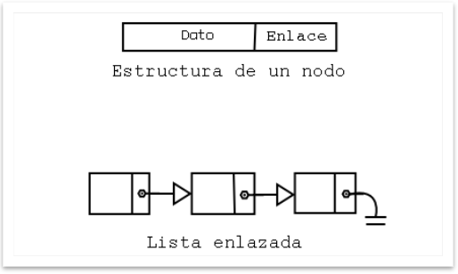
 </p>
 ---

 # Clasificación de las Listas enlazadas

 
<p align="center">
   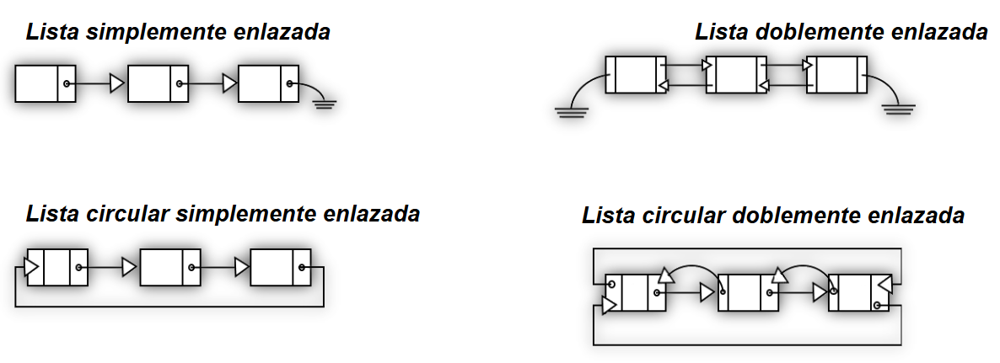
 </p>

---

# Tipo Abstracto de datos (TAD) lista

En ciencias de la computación un tipo de dato abstracto (TDA) o tipo abstracto de datos (TAD) es un modelo matemático compuesto por una colección de operaciones definidas sobre un conjunto de datos para el modelo.

Una estructura de datos es una representación (implementación) de un TAD en un lenguaje de programación. Las estructuras de datos a menudo son colecciones de variables de diferentes tipos de datos. Un TAD puede tener varias implementaciones. 

Un TAD puede describirse usando dos maneras diferentes:

- Especificación No-Formal (usando lenguaje natural) 
- Especificación Formal (usando pseudo-código o incluso algún lenguaje de programación) 
- En JAVA, las interfaces se utilizan para definir los TAD

Para que esta estructura sea un TDA lista enlazada, debe tener unos operadores asociados que permitan la manipulación de los datos que contiene. Los operadores básicos de una lista enlazada son:

- Insertar: inserta un nodo con dato x en la lista, pudiendo realizarse esta inserción al principio o final de la lista o bien en orden.
- Eliminar: elimina un nodo de la lista, puede ser según la posición o por el dato.
- Buscar: busca un elemento en la lista.
- Localizar: obtiene la posición del nodo en la lista.
- Vaciar: borra todos los elementos de la lista.


Una lista se utiliza para almacenar información del mismo tipo, con la característica de que puede contener un número indeterminado de elementos y que estos elementos mantienen un orden explícito.

Una lista es una estructura de datos dinámica. El número de nodos puede variar rápidamente en un proceso, aumentado por inserciones o disminuyendo por eliminación de nodos.

Las inserciones se pueden realizar por cualquier punto de la lista: por la cabeza (inició), por el final, a partir o antes de un nodo determinado de la lista.

---

##  Especificación formal del TAD lista

Matemáticamente, una lista es una secuencia de cero o más elementos de un determinado tipo.
Para formalizar el tipo de dato abstracto Lista a partir de la notación matemática, se define un conjunto de operaciones básicas con objetos de tipo Lista. Las operaciones son:

<p align="center">
   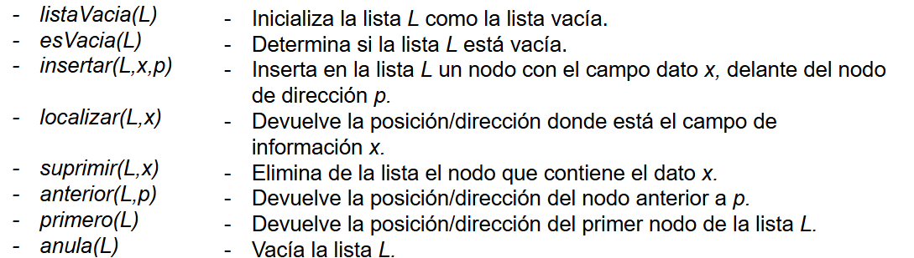
 </p>

Estas operaciones son las que pueden considerarse básicas para manejar listas. Para añadir nuevos nodos a una lista, se implementan, además de insertar(), versiones de ésta como:

- insertarPrimero(L,x)	Inserta un nodo con el dato x como primer nodo de la lista L.
- inserFinal(L,x)		Inserta un nodo con el dato x como último nodo de la lista L.

Una operación típica de toda estructura de datos enlazada es recorrer. Consiste en visitar cada uno de los datos o nodos de que consta. En las listas enlazadas, esta operación se realiza normalmente desde el nodo cabeza al último nodo o cola de la lista.

---

# Operaciones en listas enlazadas

Para la implementación se requiere, en primer lugar, declarar la clase Nodo, en la que se combinarán sus dos partes: el dato y un enlace. Además, la clase Lista con las operaciones y el atributo con la cabeza de la lista. Las operaciones tendrán las siguientes funciones:

- Inicialización o creación.
- Insertar elementos de la lista.
- Eliminar elementos de la lista.
- Buscar elementos de la lista.
- Recorrer la lista enlazada.
- Comprobar si la lista está vacía.

---

## Declaración de un Nodo

Para una lista enlazada de números enteros, la clase Nodo es:

<p align="center">
   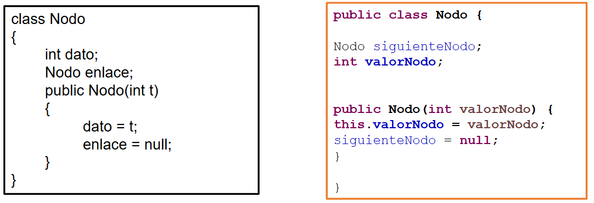
 </p>

---

## Declaración de la lista

Para una lista enlazada, la clase Lista es:

<p align="center">
   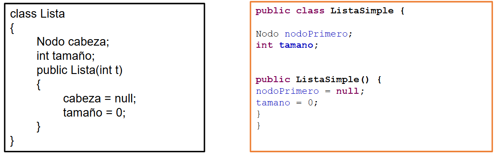
 </p>

---

# Inserción de un Elemento en una Lista

El nuevo elemento que se desea incorporar a una lista se puede insertar de distintas formas, según la posición o punto de inserción:

- En la cabeza de la lista (elemento primero).
- En el final de la lista (elemento último).
- Antes de un elemento especificado (valor nodo, posición del nodo).
- Después de un elemento especificado.(valor nodo, posición del nodo).

## Insertar un nuevo elemento en la cabeza de la lista


El proceso de inserción se resume en este algoritmo:

1. Crear un nodo e inicializar el campo dato al nuevo elemento. La referencia del nodo creado se asigna a nuevo, variable local del método.
2. Verificar si la lista no esta vacía. Dado el caso el nuevo nodo es la cabeza
3. Hacer que el campo enlace del nuevo nodo apunte a la cabeza (primero) de la lista original.
4. Hacer que primero apunte al nodo que se ha creado.


## Insertar un nuevo elemento al final de la lista

El proceso de inserción se resume en este algoritmo:

1. Crear un nodo e inicializar el campo dato al nuevo elemento. La referencia del nodo creado se asigna a nuevo, variable local del método.
2. Verificar si la lista no está vacía. Dado el caso el nuevo nodo es la cabeza
3. Hacer que el campo enlace del nuevo nodo apunte a la cabeza (primero) de la lista original.
4. Crear una variable nodo que apunte al nodo primero y luego recorrer la lista hasta llegar al último nodo.
5. Asignar como siguiente nodo de aux el nuevo nodo.
6. Aumentar el tamaño.

---

# Búsqueda en las listas enlazadas

La operación búsqueda de un elemento en una lista enlazada recorre la lista hasta encontrar el nodo con el elemento. El algoritmo que se utiliza para localizar un elemento en una lista enlazada, una vez encontrado el nodo, devuelve la referencia a ese nodo (en caso negativo, devuelve null). Otro planteamiento es que el método devuelve true si encuentra el nodo con el elemento y false si no está en la lista .

<p align="center">
   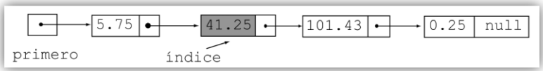
 </p>

---

# Eliminación de un nodo de una lista

1. Búsqueda del nodo que contiene el dato. Se ha de obtener la dirección del nodo a eliminar y la dirección del anterior.
2. El enlace del nodo anterior que apunte al siguiente nodo del cual se elimina.
3. Si el nodo a eliminar es la cabeza de la lista (primero), se modifica primero para que tenga la dirección del siguiente nodo.
4. Por último, la memoria ocupada por el nodo se libera. Es el propio sistema el que libera el nodo, al dejar de estar referenciado.
---

# Lista Ordenada 

<p align="center">
   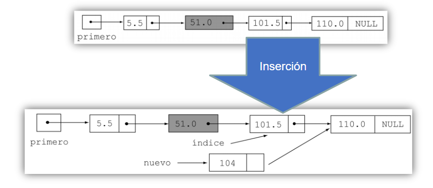
 </p>

**Tarea:** Consultar esta función 

---

# Resumen de Operaciones

1. agregarInicio
2. agregarFinal
3. agregar (Agregar en una posición específica)
4. obtenerValorNodo
5. obtenerPosicionNodo
6. indiceValido
7. estaVacia
8. eliminarPrimero
9. eliminarUltimo
10. eliminar (Eliminar por valor de un nodo)
11. modificarNodo
12. ordenarLista
13. imprimirLista
14. Iterator
15. borrarLista (Eliminar toda la lista)

---

# ListasInvertirContenido.

Codificar un método que, recibiendo como parámetro una lista genérica, invierta su contenido.

Observaciones:
- Desarrollar recursivamente
- Solo se permite la realización de un único recorrido de la lista
- No se permite la utilización de ninguna estructura de datos auxiliar.
- En caso de que la lista este vacía o posea un solo elemento, la ejecución del método no deberá surtir ningún efecto.
- Además de la lista, el método podrá recibir otros parámetros.

## Orientación: 

El ejercicio básicamente, supone desarrollar un método recursivo sin terminación anticipada (seguiremos hasta que la lista esté vacía) que, durante la fase de “ida”, recorra la lista almacenado localmente la dirección del nodo desde el que se realiza la llamada (anterior). 

Dicha referencia (anterior) se utilizará, en la fase de “vuelta”, para sustituir los sucesivos campos lista.sighuiente consiguiendo así que cado nodo pase a apuntar al anterior. 

El primer elemento, que como consecuencia de la ejecución del proceso pasará a ser el último, deberá tratarse de forma excepcional: 
Su campo siguiente deberá tomar el valor null. 

El valor inicial (y final ) de lista deberá ser el correspondiente al nodo que ocupa inicialmente la última posición. 

<p align="center">
   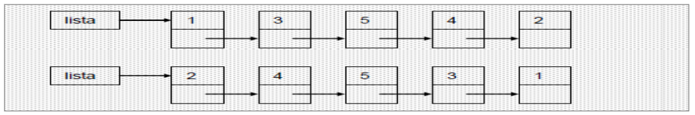
 </p>

---
# Listas Enlazadas Genéricas 

La definición de una lista está muy ligada al tipo de datos de sus elementos; así, se han puesto ejemplos en los que el tipo es int, otros en los que el tipo es double, otros String. Declarando el campo dato de tipo Object se consigue una lista genérica, válida para cualquier tipo de dato, aunque exigirá muchas conversiones de datos cuando se concrete para un tipo dato particular.

---

# Listas Circulares

Una lista circular, por propia naturaleza, no tiene ni principio ni fin. Sin embargo, resulta útil establecer un nodo a partir del cual se acceda a la lista y así poder acceder a sus nodos.

<p align="center">
   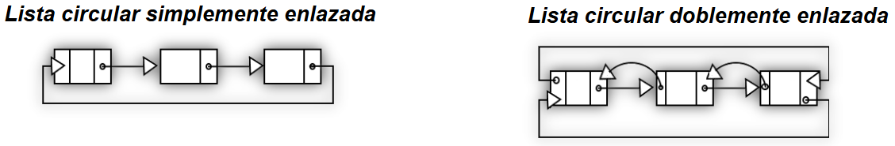
 </p>

## Operaciones 

Las operaciones que se realizan sobre una lista circular son similares a las operaciones sobre listas lineales, teniendo en cuenta que no hay primero ni ultimo nodo, aunque si un nodo de acceso a la lista. Estas operaciones permiten construir el TAD ListaCircular y su funcionalidad es la siguiente:

- Inicialización o creación.
- Inserción de elementos en una lista circular.
- Eliminación de elementos de una lista circular.
- Búsqueda de elementos de una lista circular.
- Recorrido de cada uno de los nodos de una lista circular.
- Verificación de lista vacía.

--- 

# Lista Doblemente Enlazada 

En esta lista, cada elemento contiene dos punteros (referencias), además del valor almacenado. Una referencia apunta al siguiente elemento de la lista y la otra referencia apunta al elemento anterior. 

<p align="center">
   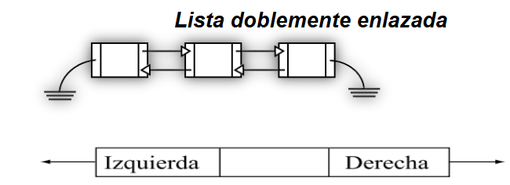
 </p>

 ## Implementación Nodo 

```
package listaDobleEnlace;
public class Nodo
{
	int dato;
	Nodo adelante;
	Nodo atras;
 // ...
}

```

```
public Nodo(int entrada)
{
dato = entrada;
adelante = atrás = null;
}

```

---

# Iterable e Iterator 

El concepto de Java Iterable es un concepto clásico en el mundo Java y existe desde la versión de Java 1.5 . Un Iterable  es un interface que hace referencia a una colección de elementos que se puede recorrer, ni más ni menos.

<p align="center">
   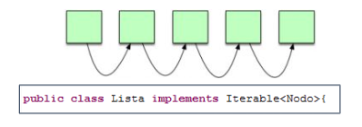
 </p>

Solo necesita que implementemos un método para poder funcionar de forma correcta, este método es iterator().

<p align="center">
   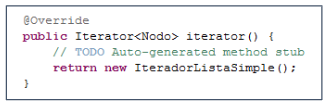
 </p>


 Este clase IteradorListaSimple es la que implementa los dos métodos del Iterator next() y hashNext() de tal forma que podamos recorrerla de forma sencilla utilizando una estructura forEach o while.

<p align="center">
   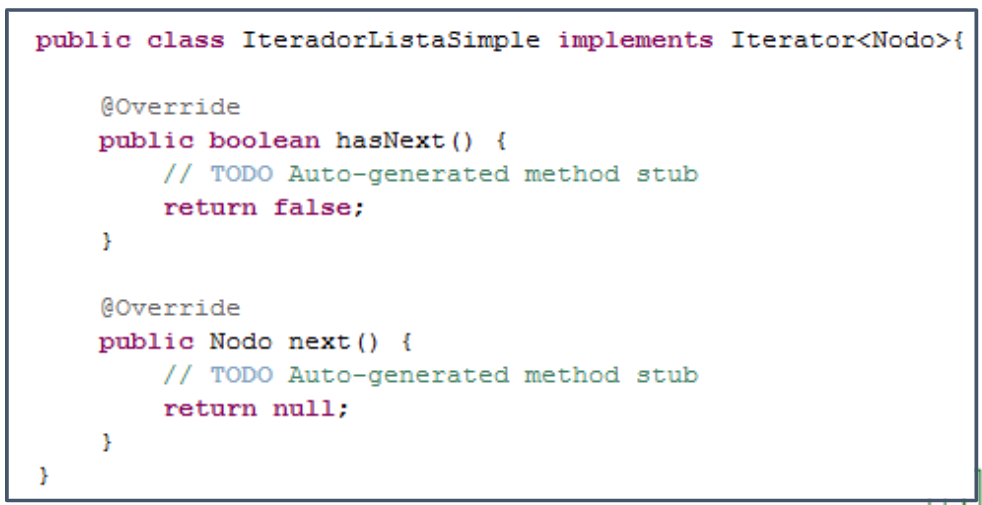
 </p>

 El interface Iterable es sencillo de implementar , simplemente hay que tener en cuenta que necesitamos una clase que implemente iterator para que este funcione. Ahora bien existen algunas otras ventajas que a veces pasan desapercibidas a nivel del API. Si nuestra clase implementa Iterable de forma automática incluirá los métodos por defecto (default methods) que este interface aporta.

<p align="center">
   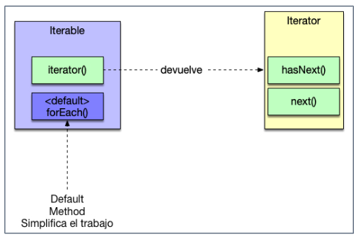
 </p>

Un iterador  es un objeto que nos permite  recorrer una lista y presentar por pantalla todos sus elementos . Dispone de dos métodos clave para realizar esta operación hasNext() y next().

<p align="center">
   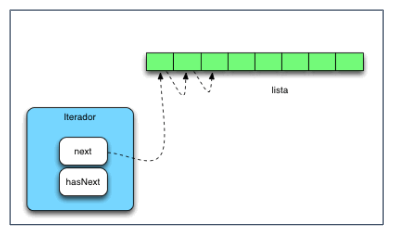
 </p>

<p align="center">
   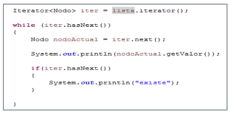
 </p>

A partir de Java 5 existe otra forma de recorrer una lista que es mucho mas cómoda y compacta , el uso de bucles foreach. Un bucle foreach se parece mucho a un bucle for con la diferencia de que no hace falta una variable i de inicialización:

<p align="center">
   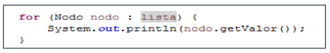
 </p>


El interface Iterator dispone de un método adicional que permite eliminar objetos de una lista mientras la recorremos (el método remove):

<p align="center">
   
 </p>